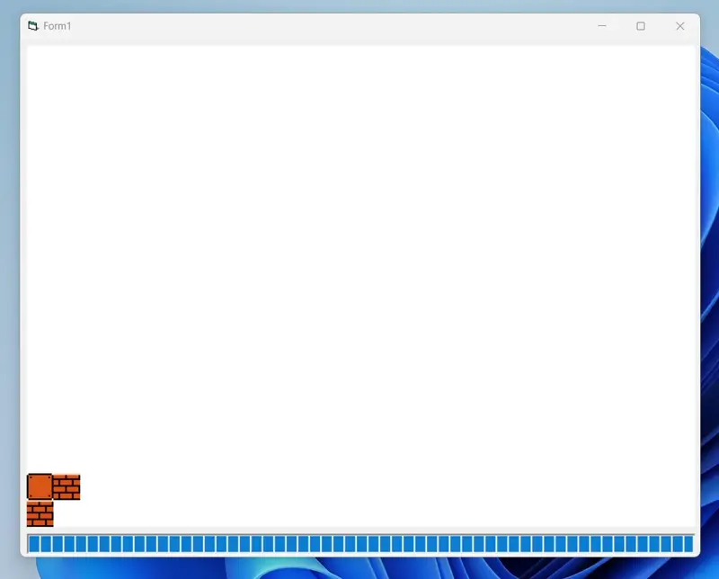

# Treasure Quest, v1

This project is my **second** attempt at making a two-dimensional [Jetpack](https://en.wikipedia.org/wiki/Jetpack_(video_game)) and/or [Lode Runner](https://en.wikipedia.org/wiki/Lode_Runner) clone within Visual Basic. It was written in the summer of 2016. Unfortunately, my *very first* attempt at developing such a game from 1999/2000 is long gone, and the third version can be [viewed here](https://github.com/kernja/vb6-treasure-quest-v2).

Regardless, these three versions all share similarities:
* Written in Visual Basic 6 (or earlier)
* Leverage GDI, [BitBlt](https://learn.microsoft.com/en-us/windows/win32/api/wingdi/nf-wingdi-bitblt), and/or [StretchBlt](https://learn.microsoft.com/en-us/windows/win32/api/wingdi/nf-wingdi-stretchblt)
* Leverage sprites and music from at-the-time contemporary video games (nowadays, I would not use such copyrighted content in my prototypes)

Of the three versions, this game would be considered the least developed. It does not allow you to collect gems, the collision detection is poor, and the editors are non-functional. However, it does feature jetpack functionality; you can fly around the screen with upward momentum and then succumb to an accelerated fall after running out of gas. 

There are three projects in this repository:
* *Game*, which loads a map for playing
    * Arrow keys to move
    * `Left Shift` to jump
    * `Z` to fly
    * `F1` to refuel
* *Editor*, which is a non-functional map editor mockup
* *Object Editor*, which is a non-functional mockup to configure object flags

Interestingly, the project uses `Public Declare Function IntersectRect Lib "user32" (lpDestRect As rect, lpSrc1Rect As rect, lpSrc2Rect As rect) As Long` to perform collision detection. 

It has been uploaded and archived to GitHub for posterity. The [provided license](SOURCECODE-LICENSE) applies only to the project's sourcecode *and not* any included media assets.

